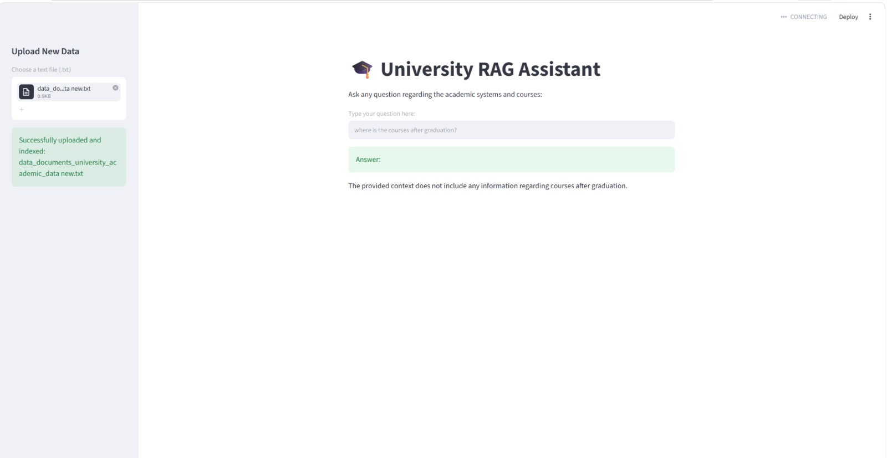

# 🎓 University RAG Assistant

A local Retrieval-Augmented Generation (RAG) system that answers questions about academic systems and courses by retrieving relevant information from custom-uploaded documents.

## 📌 Overview

University RAG Assistant lets you upload your own text documents (course catalogs, academic policies, program guides, etc.), automatically chunks and indexes them, and answers natural-language questions using an AI model grounded in that content — instead of relying purely on general knowledge.

## ✨ Features

- Upload custom `.txt` documents through a simple web interface
- Automatic document chunking and indexing
- Semantic search powered by local embedding models
- AI-generated answers grounded in your uploaded content
- Clean, interactive Streamlit UI

## 🛠️ Tech Stack

- **Interface:** Streamlit
- **Vector Database:** ChromaDB
- **Embeddings:** Sentence-Transformers (local, offline-capable)
- **LLM:** OpenRouter API (`gpt-4o-mini`)
- **Language:** Python 3.13+

## 🚀 Getting Started

### Prerequisites
- Python 3.13 or higher
- An OpenRouter API key

## 📸 Screenshot


*Streamlit interface of the University RAG Assistant — users upload academic documents on the left, then ask natural-language questions about courses and academic systems. Answers are generated only from the indexed content, and the assistant clearly states when no relevant information is found.*

## 📂 Project Structure

```
├── app.py
├── web_app.py
├── requirements.txt
├── data/
│   └── documents/
└── src/
    ├── chunker.py
    ├── document_loader.py
    ├── embeddings.py
    ├── llm.py
    ├── rag_pipeline.py
    ├── retriever.py
    ├── validator.py
    └── vector_database.py
```

## 💡 Use Case

Ask any question about academic systems and courses, and get answers based only on the documents you've provided — ideal for universities or institutions wanting a domain-specific knowledge assistant without relying entirely on external services.


SDAIA Academy: [@SDAIAAcademy][https://github.com/SDAIAAcademy]
